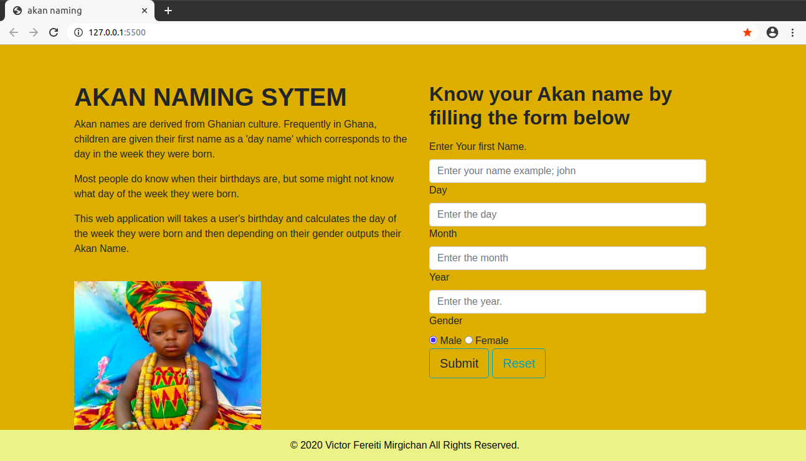
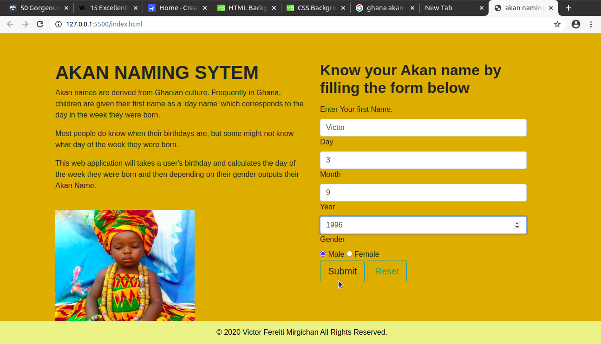
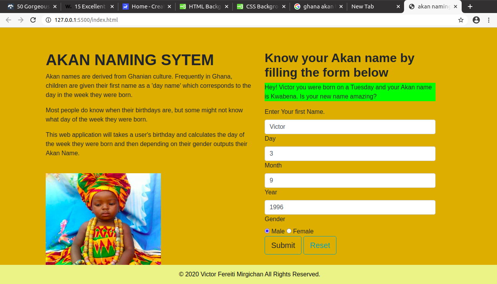

# AKAN NAMING WEB APPLICATION

#### Author: Victor Fereiti Mirgichan 

### Description: This is A web application that takes a user's birthday and calculates the day of the week they were born and then depending on their gender outputs their Akan Name. 

### A Link to published site [https://victor-mirgichan.github.io/Akan-name/]

### project setup instruction: The website will require a user to fill out information about his/her date of birth, choose his gender and then click on the submit button. The application calculates the day of the week the user was born and output their Akan name.

### licence and copyright informatioN, LICENCED UNDER MIT ()
